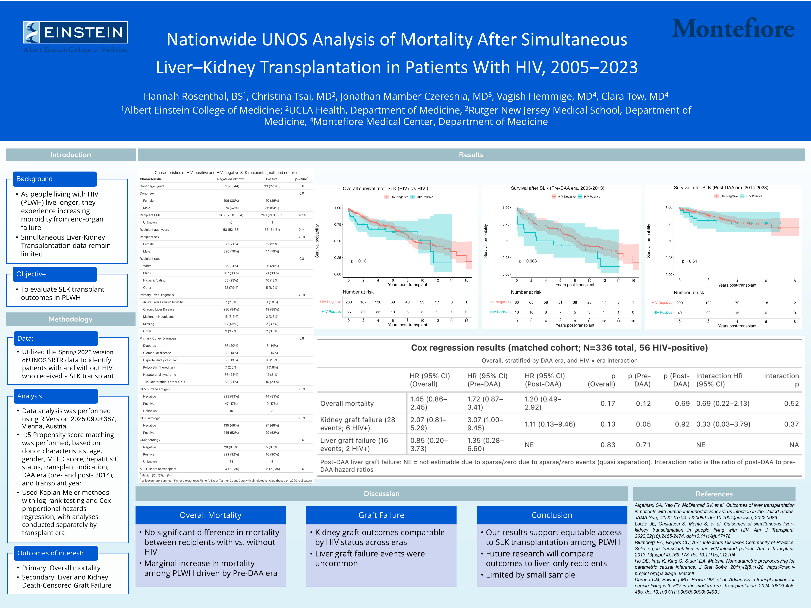

<!-- README.md is generated from README.Rmd. Please edit that file -->

```{r, include = FALSE}
knitr::opts_chunk$set(
  collapse = TRUE,
  comment = "#>"
)
```

# HIV SLK outcomes

<!-- badges: start -->
[](#)
[](#)
[](#)
<!-- badges: end -->

The goal of `HIV SLK outcomes` is to compared the outcomes of people living with HIV (PLWH) who have undergone simultaneous liver-kidney transplant to controls without HIV using the [Scientific Registry of Transplant Recipients](https://srtr.transplant.hrsa.gov/) database.

The full analysis with R code is available at [https://vagishhemmige.github.io/HIV-SLK-outcomes/](https://vagishhemmige.github.io/HIV-SLK-outcomes/).

These data have been presented at the NY-NJ Center for AIDS Research 2026 regional conference as a poster.



[Download the poster (PowerPoint)](poster/Poster.pptx)  
[Download as PDF](poster/Poster.pdf)
